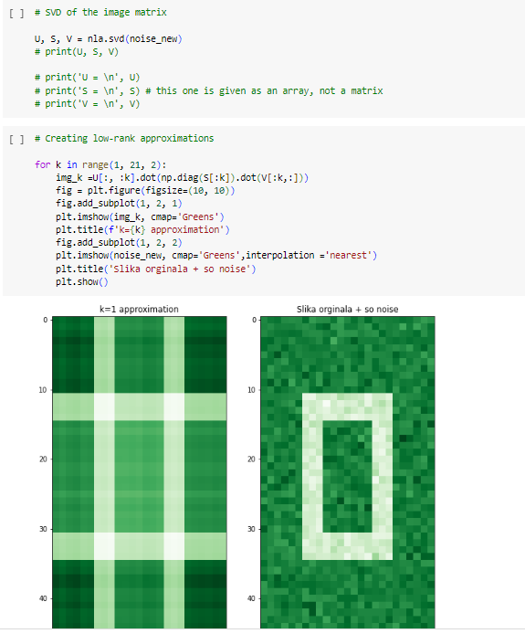

# Project Title :
Python Math & Stats Noise reduction by SVD Project.

## Project Overview :
This project focuses on the application of Singular Value Decomposition (SVD) for noise reduction in pattern data. 
The primary task involves reading, and plotting the original data, introducing noise to the dataset, 
and then utilizing low-rank approximation of a matrix to construct improved approximations of the data with added noise.

## Project Highlights :
- **Data Exploration:** The file is explored to understand the structure and patterns present in the dataset.

- **Noise Addition:** Noise is intentionally introduced to the dataset to simulate real-world scenarios and challenges.

- **Singular Value Decomposition (SVD):** The core technique used for noise reduction is SVD, a matrix factorization method that decomposes a matrix into three lower-dimensional matrices.

- **Low-Rank Approximation:** Through SVD, low-rank approximations of the original matrix are computed, offering a more robust representation of the underlying patterns while mitigating the impact of added noise.

## Project Preview :

